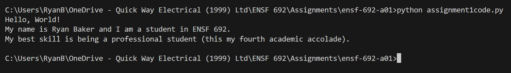
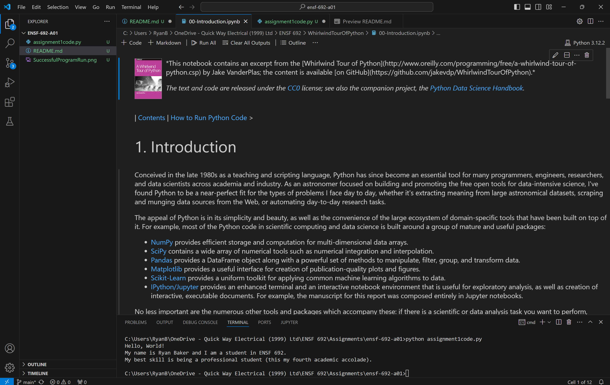

Name: Ryan Baker

Favourite inspirational quote: "I don't count the sit-ups. I only start counting when it starts hurting because they're the only ones that count. That's what makes you a champion."

\- Muhammed Ali

## 📝 ENSF 692 - Assignment 1 Tasks

-  Open VSCode and start a new terminal.
-  Edit this `README` file to add your first and last name, and your favourite inspirational quote.
-  Edit the `assignment1code.py` file by following the instructions in the comments.
-  Run the code by typing the command: `python assignment1code.py` (Make sure you are in the directory where the file is saved! Use cd to change directories.)
-  Take a screenshot of your successful program run and upload it to your assignment repository.
-  Lastly, open the course notes (the first book's associated repository) in VSCode or using Anaconda (either Jupyter Lab or Jupyter Notebook is fine).
-  Take a screenshot of the welcome chapter and upload it to your assignment repository.
-  Commit your edited `README` and code files, as well as your two new screenshots.
-  Push your local git history to github: `git push origin master`

## Assignment 1 Solutions

**Name and Inspirational Quote**

-  See at top (Marking guide in Lab 2 PDF specified name and quote must be at top of the document).

**Edited `assignment1code.py`**

-  See `assignment1code.py` in this repo.

**Screenshot of successful program run**

**Screenshot of Welcome Chapter in VSCode**

## 📚 Resources

-  [A short video explaining what GitHub is](https://www.youtube.com/watch?v=w3jLJU7DT5E&feature=youtu.be)
-  [Git and GitHub learning resources](https://docs.github.com/en/github/getting-started-with-github/git-and-github-learning-resources)
-  [Understanding the GitHub flow](https://guides.github.com/introduction/flow/)
-  [How to use GitHub branches](https://www.youtube.com/watch?v=H5GJfcp3p4Q&feature=youtu.be)
-  [Interactive Git training materials](https://githubtraining.github.io/training-manual/#/01_getting_ready_for_class)
-  [GitHub's Learning Lab](https://lab.github.com/)
-  [Education community forum](https://education.github.community/)
-  [GitHub community forum](https://github.community/)
